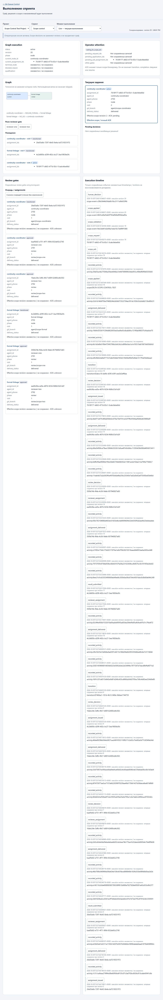
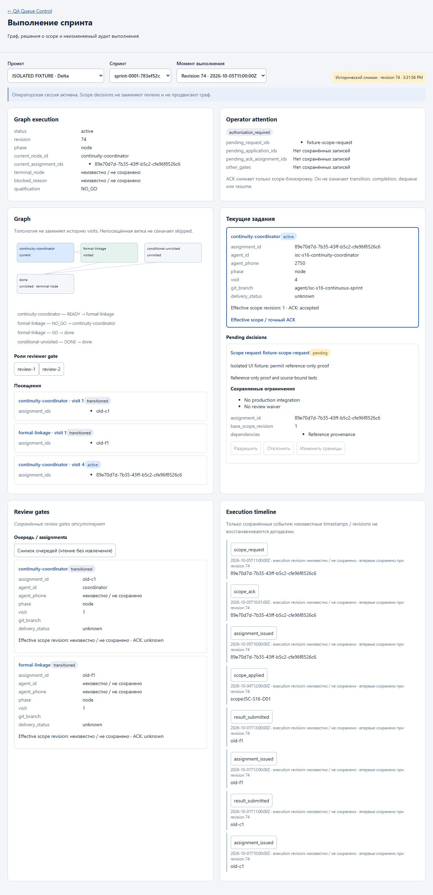
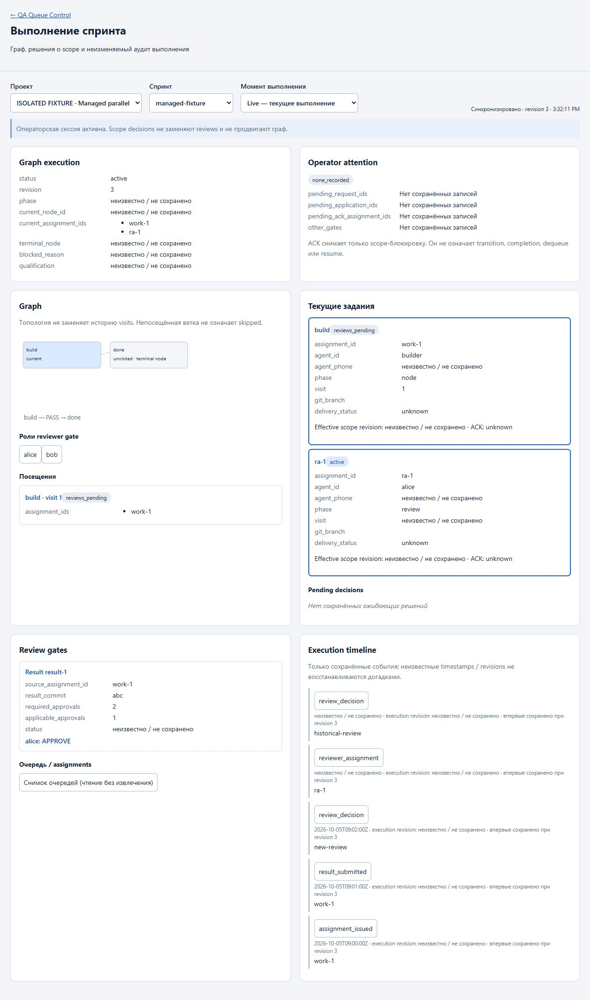

# Isolated execution UI evidence

Date: 2026-10-05. Requirements: Delta `e72e6f88abf81037a2afec408f8d023980607d66`.
Base code: `d28726bbcbb552dd21f8cda1042f39f2ee2a21ec`.
All checks used `D:\nginx-qa-scope-v2`, temporary state/Git repositories and random
loopback ports. No requests were made to live 18025/8025 by these UI checks.
Delta revision 74 below is synthetic compatibility fixture data, not current CAS.

## Real application browser integration

Harness: `tests/execution_ui_integration_server.py`, reusing
`LegacyScopeControlTests` fixtures and the real `main.app` routes. Uvicorn ran on
ephemeral port 50290 with lifespan disabled. Fixture setup imported its own sprint,
performed a historical coordinator/review/formal-NO_GO/review/return cycle,
applied version 1 and ACK in its temporary store, then migrated that fixture and
submitted a structured request through the real role-authenticated API. No
fixture mutation or import targeted live Delta.

Browser session was authorized through the actual operator session endpoint;
the test administrative token remained in harness memory, never in browser input,
output, evidence or command arguments. UI initially displayed read-only pairing,
then automatically enabled operator actions after authorization.

Observed browser flow: **Edit boundaries → real server validation → exact diff →
confirm**. The diff included the current assignment, both future nodes and both
reviewer profiles. The resulting UI showed effective revision 2, ACK pending,
the same active coordinator assignment and graph position. No UI ACK was sent.

Read-only verifier returned all of:

```json
{
  "isolated": true,
  "effective_http_status": 200,
  "effective_revision": 2,
  "assignment_preserved": true,
  "execution_fields_preserved": true,
  "prior_assignments_preserved": true,
  "old_scope_preserved": true,
  "old_ack_preserved": true,
  "queues_preserved": true,
  "history_preserved": true,
  "get_effective_is_read_only": true,
  "browser_execution_mutations": []
}
```

The verifier compares assignments, node/phase/current assignment, graph topology,
pending transition, visit counts and issued active task with the pre-request
baseline. It compares the old amendment and old ACK exactly, queue snapshots,
and conversation history SHA-256. GET effective scope left persisted bytes equal.
The only browser workflow POSTs were `/validate` and `/decisions`; the test-driver
pairing helper used `/__test__/authorize`. No browser whoami, handoff, work dequeue,
completion or ACK requests occurred. Test-only helper routes are defined only in
the executable harness and are never registered by production `main.app`.

The real application's earlier checkpoint was then selected by its saved
timestamp (execution revision 19). It displayed scope 1 with the accepted old ACK,
while Live remained scope 2. Opening the coordinator directly from Graph displayed
the same request ID and the shared Pending decisions card/actions; the historical
actions were disabled. Graph buttons are keyboard-accessible. Unchanged polling
responses update synchronization time without replacing expanded DOM content.



## Read projection / browser behavior fixtures

Harness: `tests/execution_ui_fixture_server.py`, ephemeral port 61293. This test
uses the real projection and browser assets but deliberately substitutes decision
responses; it is not evidence for backend transaction correctness.

- Delta compatibility fixture: graph execution remains `active` independently
  of `NO_GO`; coordinator visit 4 and old formal visit remain visible.
- Edited instruction requires server validation. Editing again disables confirm;
  revalidation shows the resulting content and retained restrictions.
- After fixture apply, scope 2 is `ACK pending`, not resumed/completed.
- Selecting the earlier timestamp/revision restores scope 1 and its prior ACK,
  not scope 2. All decision buttons are disabled in historical mode.
- Forced HTTP 503 shows a disconnected/retry notice. On recovery after a newer
  execution revision, polling preserves the selected historical checkpoint.
- Managed parallel fixture shows topology, occurrence, active reviewer assignment,
  queue outbox and a source-bound review gate. One approval for another result is
  excluded: applicable approvals remain 1 of 2. Missing qualification is unknown.
- Request audit contained zero whoami/work/ACK/handoff requests.





## Automated projection / asset checks

`python -m unittest tests.test_execution_observability -v`: **21 passed**.
`node --check nginx_qa/static/execution.js`: passed.

Tests cover immutable/deduplicated checkpoints, exact historical scope/ACK,
checkpoint corruption rejection, retained transitions across reconnect,
same-timestamp workflow sequence, no future events in terminal historical views,
exact review result/commit matching, independent attention/execution, old ACK
rejection in the overlay, other gates after ACK, explicit unknown values,
unvisited branches not labelled skipped, both runtime families, immutable
human-decision/conflict events and DOM-safe browser helper contracts. Additional
managed checks ensure both reviews for the same result keep separate identities,
pending journal gates are not mislabelled as graph transitions, and receipt
timestamps are not replaced by later assignment-completion timestamps. Exact
reviewed-result metadata survives replacement of the current transition pointer.

Both test servers and temporary browser tabs were stopped/closed after the checks.

### Final pinned-requirements audit correction

A subsequent read-only comparison with the exact requirements commit found that
an existing-authorization request was labelled `pending` / `authorization_required`
despite its distinct application button. This was corrected before the final
affected regression: create/list/retry now expose `approved_pending_application`,
and the same projection reports `waiting_for_scope_application`, not a new
consent request. Provenance remains visible. This status never applies scope or
grants an executor operator authority. The credentialed operator still validates
the unchanged boundaries and records existing authorization. Generic `approve`
cannot fabricate a fresh consent for that request; explicit Edit is labelled a
new semantic decision and cannot inherit the prior approval.

`python -B -m unittest tests.test_scope_workflow.DecisionLedgerTests tests.test_execution_observability -v`:
**29 passed** (8 ledger tests + 21 projection/UI tests), including exact existing
authorization status/attention, no automatic decision/application, retry,
immutable assignments/reviews, distinct recorded-authorization origin, and an
explicit newly edited boundary. Node syntax and `git diff --check` passed again.
These final checks were offline; no live endpoint or test server was started.
The screenshots above document the preceding rendered browser acceptance and do
not claim to depict this final status-label correction.

Historical mode intentionally refuses execution points that were never stored;
it does not manufacture earlier snapshots from today's state. Existing archived
records expose only data actually preserved by their runtime. This is an explicit
data-availability boundary, not inferred success or erased history.

## Screenshot integrity (SHA-256)

| File | SHA-256 |
| --- | --- |
| `scope-v2-ui-delta.png` | `e91c87aef06e14f3219166cb9952dd9e69b426eea7cd62ec3cc8005b7640c1a2` |
| `scope-v2-ui-historical.png` | `aacca43a13ea6fe420b2f818f3d6f0d599a63808cc9b9201a9057e24e165c14a` |
| `scope-v2-ui-managed.png` | `fe293dfc19a6bb18b76cabde1be49af79c784bc2a20740a7703d003fa34819d0` |
| `scope-v2-ui-real-api.png` | `c5859c22c279c78271162b6ef4414baad905a6fa5f5e45786d97796978740cc5` |

These screenshots contain only synthetic fixture instructions, never credentials
or live Delta state. UI testing used the computer-use skill to inspect the rendered
page and interact only with explicitly isolated test servers.
